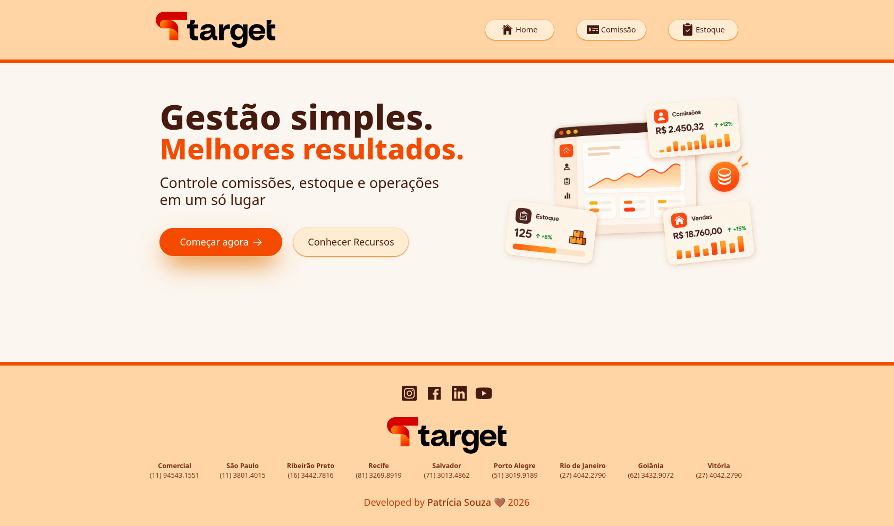
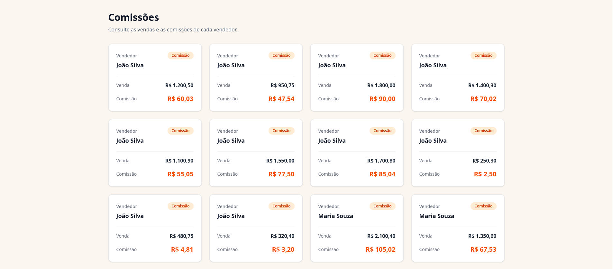
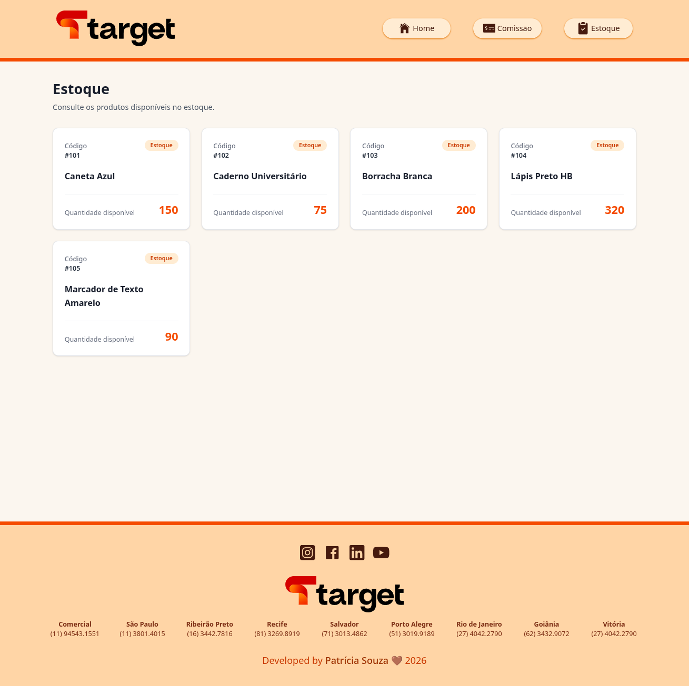

### 1. Considerando que o json abaixo tem registros de vendas de um time comercial, faça um programa que leia os dados e calcule a _comissão_ de cada vendedor, seguindo a seguinte regra para cada venda:

- Vendas abaixo de R$100,00 não gera comissão
- Vendas abaixo de R$500,00 gera 1% de comissão
- A partir de R$500,00 gera 5% de comissão

```json
{
  "vendas": [
    { "vendedor": "João Silva", "valor": 1200.5 },
    { "vendedor": "João Silva", "valor": 950.75 },
    { "vendedor": "João Silva", "valor": 1800.0 },
    { "vendedor": "João Silva", "valor": 1400.3 },
    { "vendedor": "João Silva", "valor": 1100.9 },
    { "vendedor": "João Silva", "valor": 1550.0 },
    { "vendedor": "João Silva", "valor": 1700.8 },
    { "vendedor": "João Silva", "valor": 250.3 },
    { "vendedor": "João Silva", "valor": 480.75 },
    { "vendedor": "João Silva", "valor": 320.4 },

    { "vendedor": "Maria Souza", "valor": 2100.4 },
    { "vendedor": "Maria Souza", "valor": 1350.6 },
    { "vendedor": "Maria Souza", "valor": 950.2 },
    { "vendedor": "Maria Souza", "valor": 1600.75 },
    { "vendedor": "Maria Souza", "valor": 1750.0 },
    { "vendedor": "Maria Souza", "valor": 1450.9 },
    { "vendedor": "Maria Souza", "valor": 400.5 },
    { "vendedor": "Maria Souza", "valor": 180.2 },
    { "vendedor": "Maria Souza", "valor": 90.75 },

    { "vendedor": "Carlos Oliveira", "valor": 800.5 },
    { "vendedor": "Carlos Oliveira", "valor": 1200.0 },
    { "vendedor": "Carlos Oliveira", "valor": 1950.3 },
    { "vendedor": "Carlos Oliveira", "valor": 1750.8 },
    { "vendedor": "Carlos Oliveira", "valor": 1300.6 },
    { "vendedor": "Carlos Oliveira", "valor": 300.4 },
    { "vendedor": "Carlos Oliveira", "valor": 500.0 },
    { "vendedor": "Carlos Oliveira", "valor": 125.75 },

    { "vendedor": "Ana Lima", "valor": 1000.0 },
    { "vendedor": "Ana Lima", "valor": 1100.5 },
    { "vendedor": "Ana Lima", "valor": 1250.75 },
    { "vendedor": "Ana Lima", "valor": 1400.2 },
    { "vendedor": "Ana Lima", "valor": 1550.9 },
    { "vendedor": "Ana Lima", "valor": 1650.0 },
    { "vendedor": "Ana Lima", "valor": 75.3 },
    { "vendedor": "Ana Lima", "valor": 420.9 },
    { "vendedor": "Ana Lima", "valor": 315.4 }
  ]
}
```

### 2. Faça um programa onde eu possa lançar movimentações de estoque dos produtos que estão no json abaixo, dando entrada ou saída da mercadoria no meu depósito, onde cada movimentação deve ter:

- Um número identificador único.
- Uma descrição para identificar o tipo da movimentação realizada
  E que ao final da movimentação me retorne a qtde final do estoque do produto movimentado"

```json
{
  "estoque": [
    {
      "codigoProduto": 101,
      "descricaoProduto": "Caneta Azul",
      "estoque": 150
    },
    {
      "codigoProduto": 102,
      "descricaoProduto": "Caderno Universitário",
      "estoque": 75
    },
    {
      "codigoProduto": 103,
      "descricaoProduto": "Borracha Branca",
      "estoque": 200
    },
    {
      "codigoProduto": 104,
      "descricaoProduto": "Lápis Preto HB",
      "estoque": 320
    },
    {
      "codigoProduto": 105,
      "descricaoProduto": "Marcador de Texto Amarelo",
      "estoque": 90
    }
  ]
}
```

### 3. Faça um programa que a partir de um valor e de uma data de vencimento, calcule o valor dos juros na data de hoje considerando que a multa seja de 2,5% ao dia.
